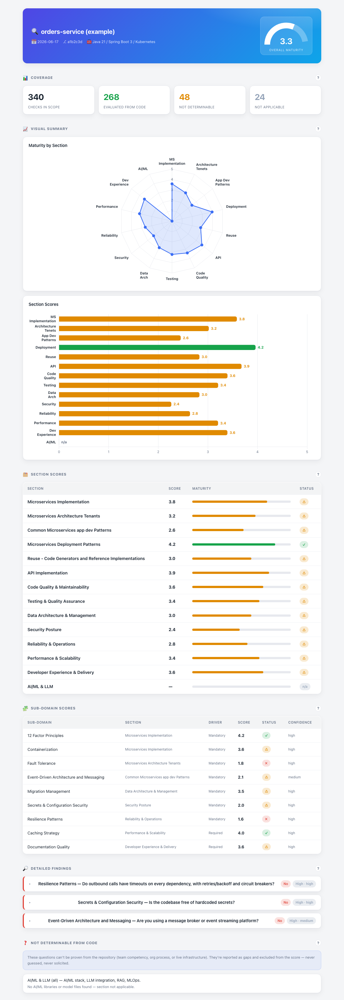

<div align="center">

# 🔍 Microservices AI Review

**Point an AI at any repo — get an evidence-based microservices maturity report with charts.**

No questionnaires. No guessing. Every finding cites a real line of code.

[](LICENSE)
[](https://claude.com/claude-code)
[](#-supported-stacks)
[](#-contributing)



</div>

---

## ✨ What it does

Run one command, point it at a repository, and an AI assessor walks a **340-question maturity checklist** — spanning microservices architecture, code quality, testing, data, security, reliability, performance, and developer experience — then produces a **self-contained HTML report** with charts and scores.

- 🤖 **Fully automated** — the model does all the work; you never answer a question.
- 🧾 **Evidence-based** — every Yes/No cites a real `file:line`. No hallucinations. ([guarantee ↓](#-evidence-based-guarantee))
- 🌐 **Stack-agnostic** — Java/Spring, .NET, Python, Node.js, Go, Rust, and more.
- 📊 **Beautiful output** — gauge, radar & bar charts in a single HTML file (light + dark mode), with per-section "?" help.
- 💸 **Economical** — gathers evidence once and reuses it, so a run stays token-light. ([details ↓](#-cost--token-economy))

## ⚙️ How it works

```
              ┌──────────────────────────────────────────────┐
  /ms-audit → │ 1. Fingerprint repo (stack, manifests, infra) │
   <repo>     │ 2. One batched evidence sweep                 │
              │ 3. Answer 340 questions from shared context   │
              └───────────────────────┬──────────────────────┘
                                      ▼
                          results.json  (evidence-based data)
                                      │  report/render.py
                                      ▼
                          report.html  (charts, opens anywhere)
```

The model produces **only data** (`results.json`); a fixed template renders the HTML. Because the model never writes markup, the presentation layer can't introduce fabrication.

## 🚀 Quick start

**Prerequisites:** [Claude Code](https://docs.claude.com/en/docs/claude-code/overview) (`npm install -g @anthropic-ai/claude-code`) and Python 3.

```bash
git clone https://github.com/fatagun/microservices-ai-review.git
cd microservices-ai-review
claude                       # launch Claude Code from the repo root
```

Then, inside the session:

```
/ms-audit ../my-service                              # a local path
/ms-audit https://github.com/acme/orders-service     # or a git URL
```

The assessor inspects the target and writes `report/report.html`. Open it in any browser. 🎉

### ⚡ Faster / cheaper runs

```
/ms-audit ../my-service --quick               # only Mandatory sub-domains
/ms-audit ../my-service --section "API Implementation"   # one section
```

### 🔭 Preview the report without running an audit

```bash
python3 report/render.py report/example-results.json report/example-report.html
open report/example-report.html   # macOS · use xdg-open on Linux, start on Windows
```

## 🧰 Supported stacks

The assessor detects your stack and looks for that ecosystem's equivalents — absence across all known equivalents means a capability is genuinely missing, not "unknown."

| Capability | Java/Spring | .NET | Python | Node.js | Go |
|---|---|---|---|---|---|
| Circuit breaker | Resilience4j | Polly | tenacity | opossum | gobreaker |
| API gateway | Spring Cloud Gateway | Ocelot / YARP | — | express-gateway | — |
| Tracing | Micrometer / OTel | OpenTelemetry .NET | otel-python | otel-js | otel-go |
| Messaging | spring-kafka | MassTransit | kafka-python / celery | kafkajs | sarama |
| API contract | springdoc | Swashbuckle | FastAPI / drf-spectacular | swagger-jsdoc | swaggo |

…plus containerization, orchestration, health probes, auth/mTLS, secrets, caching, persistence, and testing. Language-agnostic concerns (Docker, Kubernetes, CI/CD, OpenAPI, Istio) apply everywhere.

## 🧪 What it checks

**14 sections · 113 sub-domains · 340 questions**

| # | Section | Highlights |
|---|---|---|
| 1 | **Microservices Implementation** | 12-Factor, CI/CD, elastic infra, cloud-native, containerization, orchestration, GitOps/IaC, supply-chain security |
| 2 | **Architecture Tenets** | Discovery, fault tolerance, gateway, config, authN/Z, tracing, logging, metrics & golden signals, SLOs, OpenTelemetry, health-check API, mTLS/zero-trust, secrets, rate limiting, chaos, service mesh |
| 3 | **App Dev Patterns** | BFF, SPA, DDD, caching, polyglot persistence, sagas, event-driven & messaging, event sourcing/CQRS, outbox & idempotency, comms styles |
| 4 | **Deployment Patterns** | Blue/green, rolling, canary, A/B |
| 5 | **Reuse** | Reference architecture, code generators, chassis |
| 6 | **API Implementation** | Documentation, design, security, testing, management |
| 7 | **Code Quality & Maintainability** | Complexity, duplication, linting/formatting, technical debt |
| 8 | **Testing & Quality Assurance** | Coverage gates, test quality/isolation, test types, CI gate |
| 9 | **Data Architecture & Management** | Schema design, migrations, data access, multi-tenancy, audit, backup/DR |
| 10 | **Security Posture** | AuthN/credentials, secrets, OWASP Top 10, headers/TLS, injection, PII, container/IaC |
| 11 | **Reliability & Operations** | Error handling, observability pillars, resilience, health, load/chaos, feature flags |
| 12 | **Performance & Scalability** | Hotspots, DB performance, caching, async/concurrency, scalability, dependency health |
| 13 | **Developer Experience & Delivery** | Git workflow, local setup, CI/CD, docs, DORA metrics, tooling |
| 14 | **AI/ML & LLM** | AI/ML stack, LLM integration, prompt-injection, RAG, MLOps (auto-skipped when absent) |

## 📊 The report

A single self-contained `report.html` (light + dark mode) containing:

- 🎯 **Overall maturity gauge** (0–5)
- 🕸️ **Maturity-by-section radar**
- 📊 **Section-score bar** (color-coded by status, with value labels)
- 📋 **Coverage cards** — Checks in Scope · Evaluated from Code · Not Determinable · Not Applicable
- 📋 Section & sub-domain score tables
- 🔎 Collapsible findings — each with **cited evidence** and a recommendation
- ❓ The list of items not determinable from code
- ❔ A **"?" help toggle** on every section that explains how to read it

> Charts load Chart.js from a CDN, so the gauge/radar/bar need internet to render. Tables and all findings work fully offline.

## 🛡️ Evidence-based guarantee

These rules are **non-negotiable** and override coverage and score — under-claiming always beats inventing:

- ✅ **Every Yes/No cites real evidence** — a concrete `file:line` actually read. No citation → no Yes/No.
- 🚫 **Nothing is fabricated** — file names, line numbers, dependencies, and tool names are only referenced if directly observed.
- ⛔ **Absence of evidence is never a Yes** — unprovable items become **No** or **Not determinable**, never an optimistic Yes.
- 🧠 **No inference beyond the code** — not marked present just because a framework "usually" provides it.
- 🙅 **Never solicited** — questions a repo can't answer (team skills, live infra) are reported as gaps, not asked of you.

## 💸 Cost & token economy

A naive "search per question × 340" run is expensive. `/ms-audit` is built to stay cheap:

- Gathers evidence **once** (file map + one batched grep sweep) and reuses it across all questions.
- Reads only decisive files, never twice; skips lockfiles, vendored deps, and build output.
- `--quick` and `--section` flags scope the run down further.

## 📐 Scoring

| Response | Score | × High (5) | × Medium (3) | × Low (1) |
|---|---|---|---|---|
| ✅ Yes | +5 | +25 | +15 | +5 |
| ❌ No | −5 | −25 | −15 | −5 |
| ➖ NA | 0 | 0 | 0 | 0 |

Sub-domain & section scores are normalized to **0–5**: `(Σ weighted + max) / (2 × max) × 5`. Status: **✓** Strong (4–5) · **⚠** Needs work (2–4) · **✗** Critical (<2).

## 🗂️ Project layout

| Path | Purpose |
|---|---|
| `.claude/commands/ms-audit.md` | The `/ms-audit` command (assessment protocol) |
| `schema/checklist.json` | The 340-question checklist (machine-readable) |
| `schema/report.schema.json` | Data contract for `results.json` |
| `prompts/microservices-ai-review.md` | Human-readable question catalog |
| `report/template.html` | Self-contained report template (Chart.js) |
| `report/render.py` | Injects `results.json` → `report.html` (stdlib only) |
| `report/example-results.json` | Sample data for previewing the report |

## 🤝 Contributing

Contributions welcome! Good first additions: new checklist questions, more stack mappings, or report polish.

- **Add/edit questions:** keep `schema/checklist.json` and `prompts/microservices-ai-review.md` in sync (they're parallel representations).
- **Report changes:** edit `report/template.html` and preview with the render command above.
- Please keep the **evidence-based guarantee** intact — the model must never fabricate or guess.

See [CONTRIBUTING.md](CONTRIBUTING.md) for details.

## 📄 License

[MIT](LICENSE) — free to use, modify, and share.
